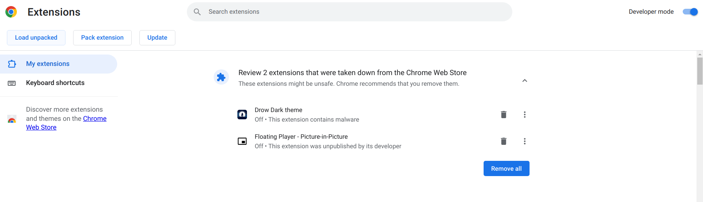

# Stuack Chrome Extension

Stuack is a Chrome extension designed for www.studocu.com, providing free access to premium features.

## Features:

- Remove Premium banners
- Blur pass
- Documents download

## Documents Download:

1. If the document is longer than 20 pages, scroll down to the end to load it (Note: scrolling too fast may not load some images).
2. Press the download button to preview the document in a new tab.
3. Press `Ctrl + P` in the new tab to print and select "Save as PDF" to download the document.

## Installation:

1. Clone the repository or download the file and unzip it into a folder.
2. Open the extensions tab in Google Chrome (chrome://extensions/).
3. Enable "Developer mode" in the top right corner.
4. Click on "Load unpacked" that appears on the top left.
5. Choose the folder where you downloaded the extension and select it.
6. Enjoy! 😊

## Upgrade:

To upgrade Stuack to the latest version, follow these steps:

1. Visit the [Stuack repository](https://github.com/Mustkeem324/Studocu-Extension) on GitHub.
2. Download the latest release or clone the repository to your local machine.
3. Unzip the downloaded file if needed.
4. Open the extensions tab in Google Chrome (`chrome://extensions/`).
5. Disable the existing Stuack extension by toggling the switch off.
6. Follow steps 3-5 from the Installation section to load the new version of the extension.
7. Enable the updated extension.
8. Enjoy the latest features and improvements! 😊

## Contribution:

We welcome contributions to improve Stuack! If you have any suggestions, bug reports, or would like to contribute to the development, feel free to create an issue or submit a pull request on our [GitHub repository](https://github.com/Mustkeem324/Studocu-Extension).

Happy studying!
